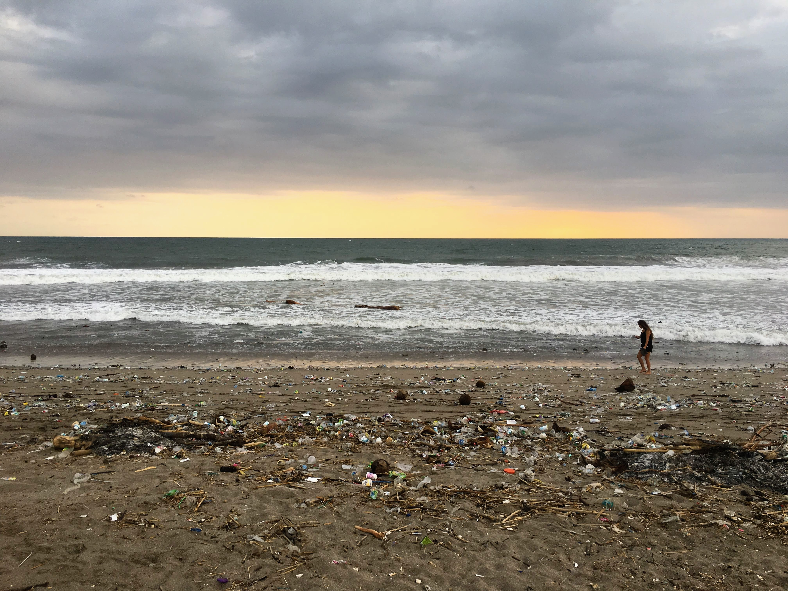

Today me and [Hanna](https://www.hannasoderquist.se/) left Canggu, Bali after roughly 5 weeks here.

Canggu is a very popular destination for surfers, yogis and digital nomads, and has recently exploded with tons of nice cafés and shops. It is not really an authentic Indonesian village anymore, but quite convenient for travellers. It is super easy to eat vegetarian and healthy, both at trendy restaurants but also at very cheap and local Warungs like [Bu Mi](https://goo.gl/maps/BT5yRb495Sy) or [Jaba](https://goo.gl/maps/HL2idUZEZJN2) (our favourite).

We stayed at a place called [Bima Sakti House](http://bimasaktihousecanggu.com/), which we liked quite a lot. We got a decent hotel room with a balcony overlooking the rice paddies, a pool, breakfast every morning, and a very good location in the middle on Canggu. We initially only booked a week, but ended up extending our stay for another month. For a month we payed 7.5 million IDR (~4600 SEK, ~$518) for a double room. It was not really a luxury hotel, but a nice deal for our budget. While on the budget topic, in addition to the hotel we did spend around ~6.5 million IDR (~4000 SEK, $450) per person in December living in Canggu.

    
     
    <em>Breakfast on our balcony 😍</em>

We spent most of our time working on exciting projects, while hanging out in different coworking-places and cafés. Our favourite one was [Amo](https://www.amospa.com/) (which actually is a spa but with a nice café in the lobby) and we also spent a couple of days at [Machinery](https://machinerycafebali.wordpress.com/). We bought a membership to the coworking-place [Dojo](https://www.dojobali.org/), which has a great community of like minded folks, tons of events and a great working spot. However, a membership at Dojo might be a bit expensive if you travel on a budget or, like us, don't have a steady income.

We did [launch a mini-product we call Line Wizard](/linewizard). Did you ever get frustrated when trying to make line breaks on Instagram and ended up doing ugly dots everywhere? No more ugly dots. Go check out Line Wizard at [www.linewizard.club](https://www.linewizard.club) and the wizard will give you a clean post.

I realised I could redeem a free night on Hotels which were about to expire, so we had to spend it here in Canggu. For the price of a regular hotel night in the US and Europe, you get a honeymoon villa and a "floating breakfast" 😅

    
     
    <em>A floating breakfast 😅</em>

In the middle of our stay here, the beach was filled with plastic and dirt. Kind of depressing. However it was apparently not a new phenomenon because every year during the rainy season, the rain flushes down all the plastic dirt from the island villages into the ocean via the rivers 😞

    
     
    <em>Plastic at the Canggu Beach 🏖</em>

On the touristy side, we did snorkel in the corals outside of Nusa Lembongan, which was kind of awesome and we saw the most funny fishes ever. Also we tried surfing which was fun. Pro tip: if you are a newbie and want to surf here, go to Kuta which has much better water for beginners.

All the best,
