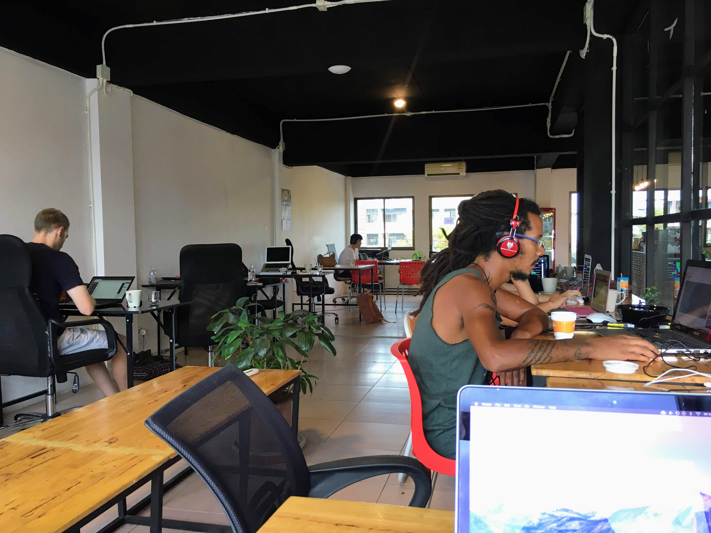
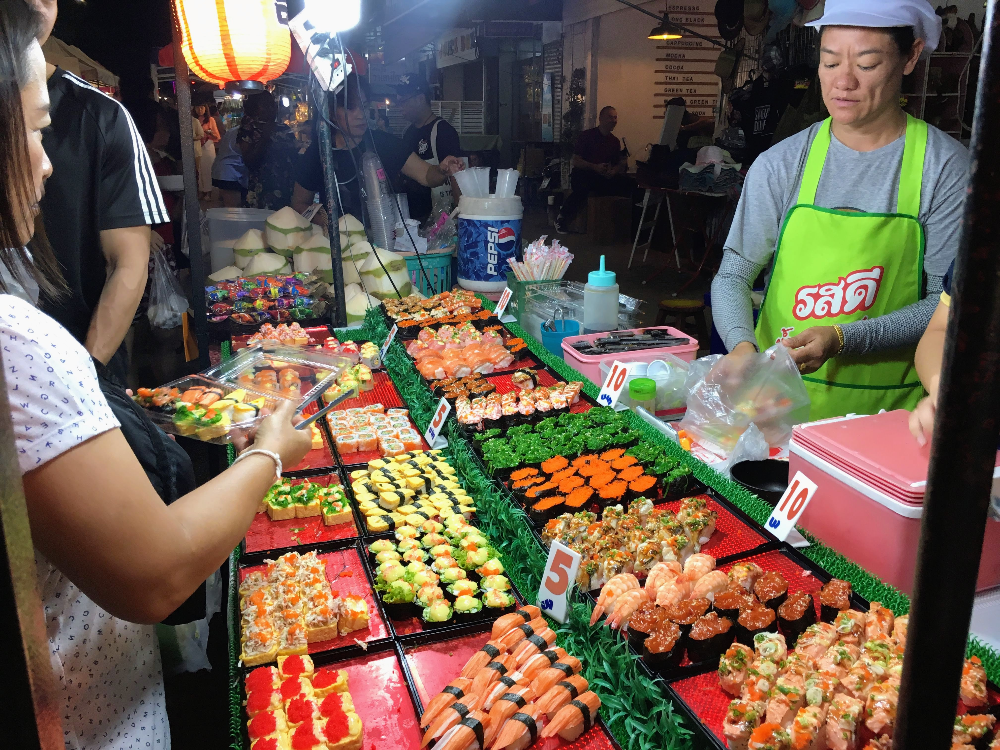
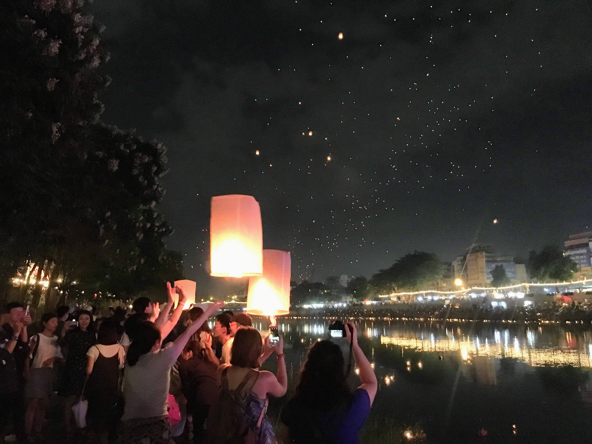

Hanna decided to take a [small detour from our Asia trip](http://www.hannasoderquist.se/blog/ett-halvt-varv-runt-jorden), so I decided to go and visit Chiang Mai in Thailand for two weeks. Chiang Mai is usually at the [top of Nomad List](https://nomadlist.com/) (a website listing good cities for digital nomads; [check my profile to see where I am at the moment](https://nomadlist.com/@niklaslavrell)), so I figured it was worth a visit.

I stayed at a hostel called [In the City Hostel](https://goo.gl/maps/VYH8db9rnCG2), located centrally in the northwest corner of the Old City. I had a bed in a dormitory, free access to a coworking space (which mainly was reserved for people staying at the hostel), free water, coffee, fruit, laundry, and one meal a day. Very convenient overall and with the cost being only 300 thai bath (~82 SEK, ~\$9,3) per night, it was a very good deal.

There where a dozen other people living and hanging out at the coworking-space. I met some great people there and had a great time with late evenings out clubbing and chilling at the rooftop. For anyone working and traveling (especially alone) on a budget, I can totally recommend it!

  <figure>
    
    <figcaption>
      <small>Early morning at In The City 👨‍💻</small>
    </figcaption>
  </figure>

The Old City of Chiang Mai was packed with beautiful and cozy temples all around, everything within walking distance from the hostel. Also the street food was super good; maybe the best I've ever had. Especially during Sunday evenings, as the Sunday Night Market took place, I just strolled around for hours while my dinner of various finger foods. People wasn't as pushy here as in Vietnam, which was quite relaxing.

  <figure>
    
    <figcaption>
      <small>Sushi at the Sunday Night Market 🍣</small>
    </figcaption>
  </figure>

I was super lucky to visit this time of year, since the Lantern Festival happened to take place during my visit. It was an amazing experience as people released several hundreds of lanterns into the air and put floating candles into the river. Apparently the candles said to be accompanied by hair and fingernails of people hoping to float away negative thoughts.

  <figure>
    
    <figcaption>
      <small>Lantern Festival in Chiang Mai 😍</small>
    </figcaption>
  </figure>

During my stay in Chiang Mai I mostly worked on [my stock robot app Chekr](https://www.chekr.app/). I figured someone else might benefit from it as well, so I sort of rebuilt the entire web application in React and added support for user accounts, so now anyone can sign up! You can read more about it in the previous blog post.

Otherwise, I didn't do much touristy things in Chiang Mai. In the City was almost too productive. However, I look forward to come back to Chiang Mai soon!
