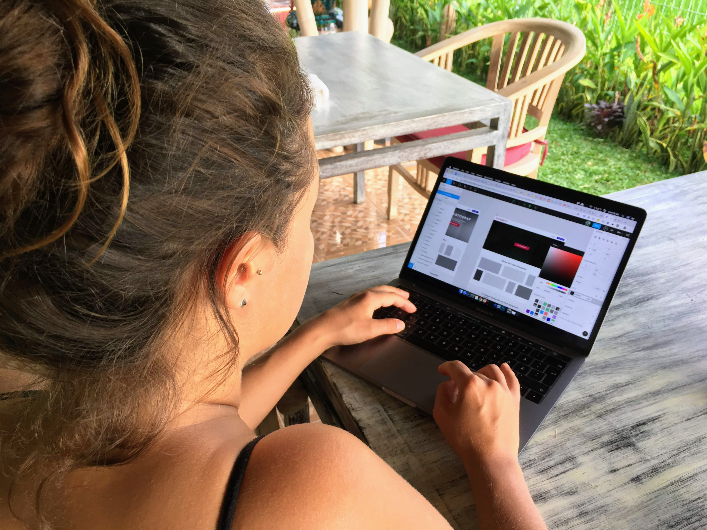

Woho 🎉 here we go! [Hanna](https://www.hannasoderquist.se/) and I have been working on a new product for the last month. We have been thinking about this for a while, so it was nice that we could finally prioritise it!

[Hanna has been a professional photographer](https://www.hannasoderquist.se/photography) for a couple of years and I have seen her spending a lot of time with quite a lot of things that aren't really photography - keeping a cumbersome portfolio website updated, SEO, doing online and social media marketing, keeping track of customers, answering irrelevant customer inquiries, and more. Many other photographers also seem to experience the same problems.

From a customer perspective, finding a photographer might not be the best experience either. Only the best photographers get found on a Google search, which might not be what I am looking for. Also it can be hard to understand and compare the offers between photographers, and usually pricing is not public.

I could think of many moments in my life where it would have been nice to have a photographer to prolong the experiences, like family birthday parties or a random ceremony. It doesn't have to be an experienced photographer, just a few thought through photos from those moments would have been worth a lot for me today. However, hiring a photographer today feels too much of a hurdle and too expensive for my taste. At the same time, Hanna has found it common that amateur photographers find it hard to get their first couple of gigs, without any reach or references.

  <figure>
    
    <figcaption>
      <small>Making Focolio 👩‍💻</small>
    </figcaption>
  </figure>

We felt like we could create a better experience for both parts, so we decided to try. Announcing [Focolio - a website connecting photographers and customers!](https://www.focolio.com/) We are still in a closed beta, but as of writing we have 30+ published photographers from Sweden!

We want to create a platform that solves common problems for photographers and at a same time make it easier for customers to hire photographers that suits their needs.

We'll see how it goes!

/Niklas

  <figure>
    
    <figcaption>
      <small>Focolio 📸</small>
    </figcaption>
  </figure>

